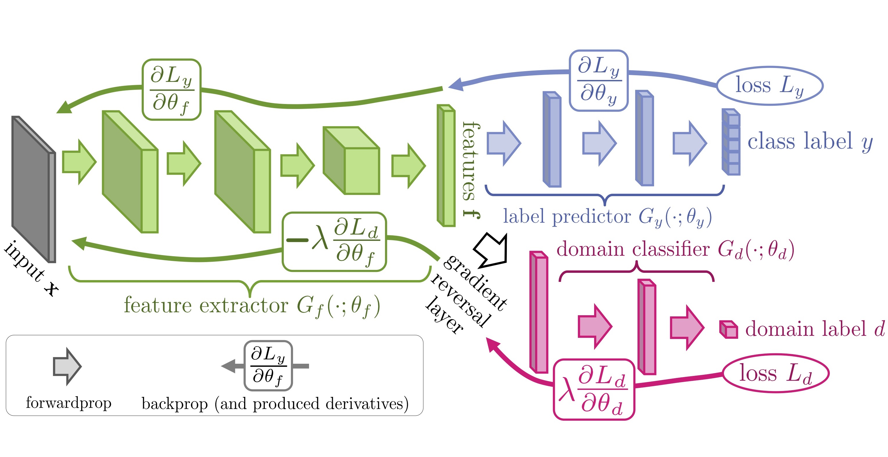

# XAI611 project proposal
Advanced big data analysis (23-1)

## Baseline model



## Dataset
```
root
│───data
│   │───ADNI1
│   │   │───AD
│   │   │   └───slice_adni1_id_7161.png
│   │   │   ...
│   │   │───CN
│   │   │   └───slice_adni1_id_7024.png
│   │   │   ...
│   │
│   └───ADNI2
│   │   │───AD
│   │   │   └───slice_adni1_id_218391.png
│   │   │   ...
│   │   │───CN
│   │   │   └───slice_adni1_id_224603.png
│   │   │   ...
│   └───ADNI2_test
│   │   │───AD
│   │   │   └───slice_adni1_id_253758.png
│   │   │   ...
│   │   │───CN
│   │   │   └───slice_adni1_id_221789.png
└───    │   ...
```
The full dataset is available via the link below.

[\[Full dataset download\]](https://drive.google.com/file/d/1DXnP2j9aIikJJhdX-a1WYxJw-IzZ-BDP/view?usp=sharing)

⚠️ A validation set is not provided separately, and you can define it directly in the train dataset.

## Setup

- Python 3.7.10
- CUDA Version 11.0

1. Nvidia driver, CUDA toolkit 11.0, install Anaconda.

2. Install pytorch
```
conda install pytorch torchvision cudatoolkit=11.0 -c pytorch
```

3. Install various necessary packages

```
pip install scikit-learn numpy torchio tqdm argparse GPUtil
```

## Training

When using Terminal, directly execute the code below after setting the path

```
python train.py --gpu 0 --model_name custom_name --batch_size 16 --source adni1 --target adni2 --init_lr 1e-4 --epochs 100
```


## Evaluting

You can use the model used for training earlier, or you can evaluate it by specifying the model in --load_model

```
python test.py --gpu 0 --load_model trained_model --batch_size 1
```
